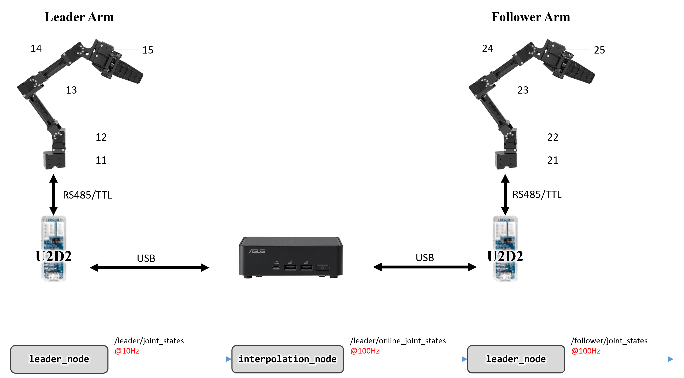

# 🦾 Dynamixel Teleoperation System

This repository provides a **teleoperation system using Dynamixel motors**, built with Python and ROS. Key features include:

- High-speed communication using `GroupSyncRead` / `GroupSyncWrite`
- Immediate compatibility with OpenManipulator (only motor ID and baudrate setup required)
- Smooth tracking with linear interpolation
- Flexible configuration via YAML files for motor setup and control modes

> ⚠️ This system has been verified only with Dynamixel **X-series** motors. Y/P-series are untested.

---

## 🖧 System Overview

### 🔗 Connection Architecture
```
PC ⇄ U2D2 ⇄ Leader Arm
   ⇄ U2D2 ⇄ Follower Arm
```

### 📡 ROS Topics

| Node Name         | Subscribed Topics          | Published Topics               |
|-------------------|----------------------------|--------------------------------|
| `leader_node`     | -                          | `/leader/joint_state`          |
| `interpolation_node` | `/leader/joint_state`     | `/leader/online_joint_state`   |
| `follower_node`   | `/leader/online_joint_state` | `/follower/joint_state`        |

<p align="center">
  
</p>

---

## 🔧 Hardware Setup

### 🧰 Driver & Permissions

```bash
# Install Dynamixel Wizard
cd ~/Downloads/
wget -O DynamixelWizard2Setup_x64 "https://www.dropbox.com/s/csawv9qzl8m8e0d/DynamixelWizard2Setup-x86_64?dl=1"
chmod +x DynamixelWizard2Setup_x64
./DynamixelWizard2Setup_x64

# Grant USB access permissions
sudo usermod -aG dialout "$USER"

# udev rule setup
wget https://raw.githubusercontent.com/ROBOTIS-GIT/dynamixel-workbench/master/99-dynamixel-workbench-cdc.rules
sudo mv 99-dynamixel-workbench-cdc.rules /etc/udev/rules.d/
sudo udevadm control --reload-rules
sudo udevadm trigger
```

### 🔢 Motor ID Assignment

- Communication speed: **4 Mbps (common for all motors)**

| Joint         | Leader ID | Follower ID |
|---------------|-----------|-------------|
| arm/joint1    | 11        | 21          |
| arm/joint2    | 12        | 22          |
| arm/joint3    | 13        | 23          |
| arm/joint4    | 14        | 24          |
| arm/joint5    | 15        | 25          |

### 🔌 Fixed Device Names via udev
Linux assigns USB device names like /dev/ttyUSB0 dynamically, which can change across reboots. To avoid this, bind devices using udev rules for persistent naming.

#### Example Symbolic Links
- `/dev/ttyDXL_leader`
- `/dev/ttyDXL_follower`

#### Setup Instructions
Find the current device path (e.g., /dev/ttyUSB0) and get seiral number

```bash
# Check serial number
udevadm info --name=/dev/ttyUSB0 --attribute-walk | grep serial

# Create udev rule
sudo nano /etc/udev/rules.d/99-fixed-dynamixel.rules
```

Add a line like this:
```bash
SUBSYSTEM=="tty", ATTRS{serial}=="<serial_leader>", SYMLINK+="ttyDXL_leader"
SUBSYSTEM=="tty", ATTRS{serial}=="<serial_follower>", SYMLINK+="ttyDXL_follower"
```

```bash
# Apply changes
sudo udevadm control --reload
sudo udevadm trigger

# Check created symbolic links
ls /dev/ttyDXL_*
```

---

## 💻 Software Installation

### 1. ROS Noetic (Ubuntu 20.04)
Follow the [official installation guide](https://wiki.ros.org/noetic/Installation/Ubuntu)

### 2. Dynamixel SDK

```bash
pip3 install -U pip
pip3 install dynamixel_sdk
```

### 3. Build ROS Package

```bash
cd ~/catkin_ws/src/
git clone https://github.com/ogata-lab/dynamixel_teleop.git
cd ~/catkin_ws
catkin build
```

---

## 🚀 Execution (Teleoperation)

Since `interpolation_node` performs linear interpolation based on the control frequency defined in `rosparam`, always start nodes in the following order:

```bash
# Leader Arm
roslaunch leader_controller leader_bringup.launch

# Follower Arm
roslaunch follower_controller follower_bringup.launch
```

---

## ⏱ Communication Check

Verify that the control frequency is as expected:

```bash
rostopic hz /leader/joint_states          # ~10 Hz
rostopic hz /leader/online_joint_states   # ~100 Hz
rostopic hz /follower/joint_states        # ~100 Hz
```

---

## 🔧 Customization

### ✅ Edit Configuration Files (e.g. YAML)
Control modes (e.g., Position Control, Current-based Position Control) and motor IDs can be configured in YAML:

```yaml
device: '/dev/ttyDXL_leader'
baudrate: 4000000
control_freq: 10

arm/joint1:
  id: 11
  operating_mode: 3  # Position Control
```

When using a new configuration file like `follower_new.yaml`, be sure to update the `param_name` in the launch file:

```xml
<launch>
  <node pkg="robot_description" type="load_config.py"
        args="--param_name=follower --config=$(find robot_description)/config/follower_new.yaml"/>
  <node pkg="follower_controller" type="follower_node.py" output="screen"/>
  <node pkg="follower_controller" type="interpolation_node.py" output="screen"/>
</launch>
```

### ✅ Change Control Frequency
If you change the control frequency from 100Hz to 200Hz in follower.yaml, make sure to update the interpolation_node frequency via launch arguments:

```bash
roslaunch follower_controller follower_bringup.launch follower_freq:=200
```

Likewise, you can change the leader's frequency as well:
>⚠️ Don’t forget to update leader_freq if you're generating motion at 5Hz using a foundation model.


```bash
roslaunch follower_controller follower_bringup.launch leader_freq:=5
```


---

## 💡 Application: Online Motion Generation

You can implement online motion generation using deep predictive learning or foundation models.  
Make sure the inference frequency `freq` matches `interpolation_node`'s `leader_freq`.

```python
import rospy
from sensor_msgs.msg import JointState, Image
from cv_bridge import CvBridge
import numpy as np

class RTControl:
    def __init__(self, exptime=10, freq=10):
        self.rate = rospy.Rate(freq)
        self.loop = int(freq * exptime)
        self.bridge = CvBridge()

        rospy.Subscriber("/follower/joint_states", JointState, self.joint_callback)
        rospy.Subscriber("/camera/color/image_raw", Image, self.image_callback)
        self.pub = rospy.Publisher("/leader/joint_states", JointState, queue_size=1)
        self.msg = JointState()

    def joint_callback(self, msg):
        self.current_position = np.array(msg.position)

    def image_callback(self, msg):
        self.current_image = self.bridge.imgmsg_to_cv2(msg, "bgr8")

    def run(self):
        for _ in range(self.loop):
            pred = model(self.current_position, self.current_image)
            self.msg.header.stamp = rospy.Time.now()
            self.msg.position = pred
            self.pub.publish(self.msg)
            self.rate.sleep()
```

